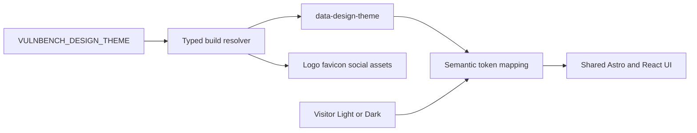

# Snyk 2026 Brand Theme Implementation Plan

## Architecture

The deployment selects `classic` or `snyk-2026`; the browser continues to select only `light` or `dark`. Classic remains the unconfigured default, while invalid explicit values fail the build.

## Implementation

1. **Persist the accepted plan and add the tested build contract**
   - Save this plan at [`docs/superpowers/plans/2026-08-05-snyk-2026-brand-theme.md`](docs/superpowers/plans/2026-08-05-snyk-2026-brand-theme.md).
   - Add [`src/config/design-theme.ts`](src/config/design-theme.ts), [`src/config/theme-colors.ts`](src/config/theme-colors.ts), and Vitest coverage for unset, `classic`, `snyk-2026`, and invalid values.
   - Resolve from `process.env.VULNBENCH_DESIGN_THEME` only during Astro build/config evaluation; expose typed asset paths and `#2B0250`/`#030328` branded browser colors.
   - Wire [`astro.config.ts`](astro.config.ts), [`src/layouts/BaseLayout.astro`](src/layouts/BaseLayout.astro), and [`src/components/site/ThemeToggle.astro`](src/components/site/ThemeToggle.astro) so `<html>` receives `data-design-theme`, both pre-paint scripts share one color map, and existing `vulnbench-theme` behavior remains unchanged.

2. **Add approved local assets and Geist typography**
   - Run package-health checks, then add the latest `@fontsource-variable/geist` and `@fontsource-variable/geist-mono` packages through npm inside `vulnbench-dev`.
   - Copy the approved `logo-snyk-white.png` and required gradient/no-gradient corner PNGs from the attached brand skill into [`public/brand/snyk-2026/`](public/brand/snyk-2026/) without editing them; record source paths, dimensions, and checksums in `PROVENANCE.md`.
   - Add a branded favicon and default social SVG using only Midnight, the locked palette, solid white text, and the sanctioned gradient.

3. **Implement the isolated Snyk token and layout layer**
   - Add [`src/styles/tokens-snyk-2026.css`](src/styles/tokens-snyk-2026.css) and import it after [`src/styles/tokens.css`](src/styles/tokens.css) from [`src/styles/global.css`](src/styles/global.css).
   - Map every existing semantic surface, text, evidence, heatmap, series, focus, and font token under combined `data-design-theme`/`data-theme` selectors; mirror the no-JavaScript dark media fallback.
   - Family A Dark uses Midnight with gradient fabric. Family B Light uses the full Brand Gradient with white copy and opaque Midnight analytical panels. Avoid gradient text, masks, pseudo-element gradient borders, glass, decorative shadows, and radial glow divs.
   - Replace the continuous `color-mix` heatmap in [`src/components/explorer/views/CoverageView.tsx`](src/components/explorer/views/CoverageView.tsx) with tested discrete semantic heatmap bands so branded output remains locked-palette and color-independent.

4. **Apply the branded shell and homepage composition**
   - Add focused [`src/components/site/SnykLogo.astro`](src/components/site/SnykLogo.astro) and [`src/components/site/BrandFabric.astro`](src/components/site/BrandFabric.astro) components.
   - In [`src/components/site/SiteHeader.astro`](src/components/site/SiteHeader.astro), select the official Snyk wordmark for branded builds while keeping VulnBench product identity spatially separate; retain the Classic wordmark unchanged.
   - Give [`src/components/site/SiteFooter.astro`](src/components/site/SiteFooter.astro) an opaque Midnight branded treatment and keep fabric out of the footer.
   - Scope the strongest composition to [`src/components/home/Hero.astro`](src/components/home/Hero.astro): left-aligned research copy over the dark region, quantitative evidence intact, one contained fabric corner, responsive `clamp()` headings, and no overlap at 320px.

5. **Make exports and static identity build-aware**
   - Extend [`src/components/explorer/export.test.ts`](src/components/explorer/export.test.ts) first, then preserve computed-token export behavior in [`src/components/explorer/export.ts`](src/components/explorer/export.ts) so standalone SVGs inline Geist and locked branded colors without unresolved CSS variables.
   - Branch the renderer in [`src/pages/social/js-1.0/[view].svg.ts`](src/pages/social/js-1.0/[view].svg.ts) at build time: Classic output remains unchanged; branded output uses one full Brand Gradient, solid white Geist/Geist Mono text, and keeps all provenance and caveats.
   - Select branded favicon/default OG paths in `BaseLayout` while retaining stable view-share-card URLs and canonical metadata.

6. **Add a self-contained branded verification gate**
   - Extract reusable theme helpers from [`tests/e2e/theme.spec.ts`](tests/e2e/theme.spec.ts).
   - Add [`playwright.snyk-2026.config.ts`](playwright.snyk-2026.config.ts) on a separate port with `VULNBENCH_DESIGN_THEME=snyk-2026`, plus [`tests/e2e/design-theme.spec.ts`](tests/e2e/design-theme.spec.ts).
   - Cover both branded color modes, persisted mode behavior, no-JavaScript fallback, Geist loading, logo/fabric presence and clearance, branded metadata, chart exports, 320px overflow, representative explorer layouts, and Axe across all public routes.
   - Add [`scripts/check-snyk-brand.mjs`](scripts/check-snyk-brand.mjs), porting the supplied mechanical audit rules to the mandated Node container. Scan branded source/static outputs for off-palette colors, off-brand fonts, forbidden CSS, fixed hero pixels, and unauthorized gradients.
   - Add `build:snyk-2026`, `test:e2e:snyk-2026`, `check:brand`, and `verify:snyk-2026` scripts; make the full `npm run verify` gate exercise both Classic and branded builds without adding client-side design-theme JavaScript.

7. **Document the deployment and rule boundary**
   - Update [`README.md`](README.md) with allowed environment values, build examples, and the brand spec link.
   - Update [`AGENTS.md`](AGENTS.md), [`CLAUDE.md`](CLAUDE.md), and [`docs/CONVENTIONS.md`](docs/CONVENTIONS.md) so warm-neutral/no-gradient rules remain authoritative for Classic and the Snyk 2026 spec governs only branded builds.
   - Clarify in the prior dark-mode spec that canonical-light social assets apply to Classic, while build-selected Snyk assets follow the newer specification.

8. **Audit, verify, and deliver**
   - Render and read back desktop/mobile screenshots of the homepage in both branded modes plus release evidence and explorer coverage views; fix every §10 brand-audit failure.
   - Run dependency health/security checks, first-party Snyk Code/SCA scans with benchmark fixtures treated as expected evidence, source-integrity tests, `npm run verify`, and the explicit branded gate inside `vulnbench-dev`.
   - Commit cohesive TDD stages on `feat/snyk-2026-brand-theme`, push the branch, create the PR with summary/test plan, and return its URL. Include draft-only Jira and `#ask-brand-design` approval text; do not submit either externally.
